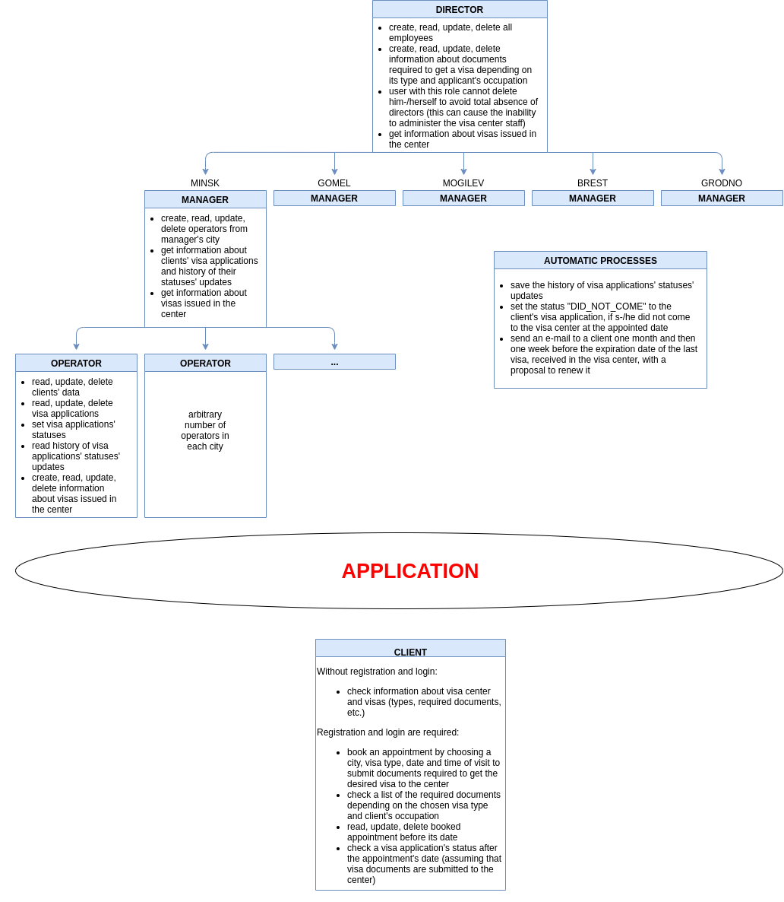
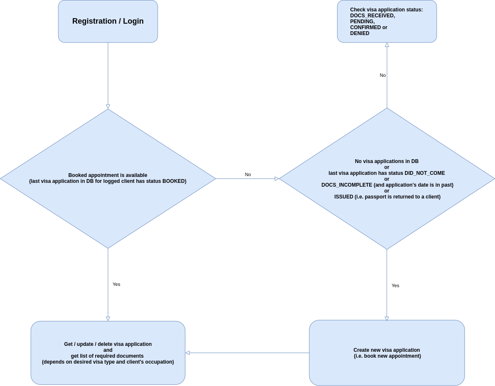
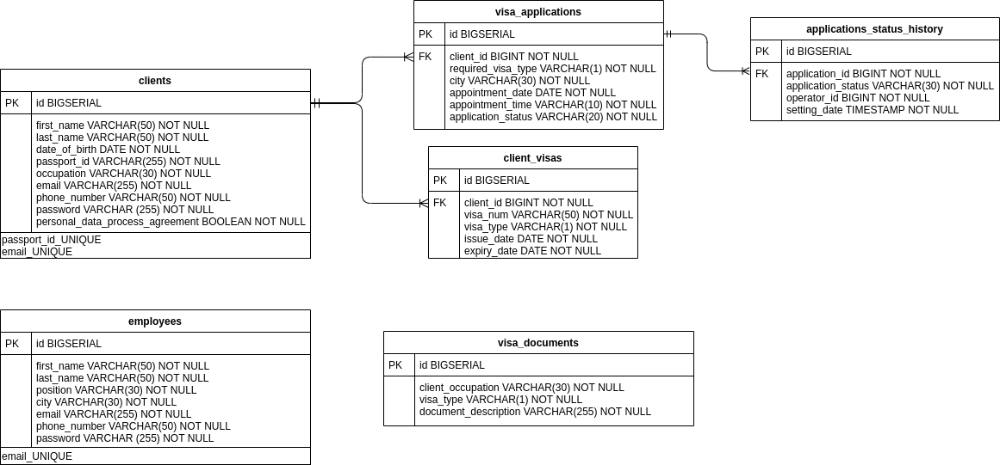

# PolishVisaCenter
This is a RESTful web-service simulating the work processes of the Polish Visa Center in Belarus.

<h2>Technologies:</h2>
<ul>
  <li>Java 8</li>
  <li>Spring (Boot, Data, Security)</li>
  <li>PostgreSQL</li>
  <li>Flyway</li>
  <li>Maven</li>
  <li>JWT</li>
  <li>JSON</li>
  <li>HATEOAS</li>
  <li>log4j2</li>
  <li>Spring Boot Test</li>
  <li>JUnit</li>
  <li>Lombok</li>
</ul>

<h2>Domain structure & Functionality:</h2>

<h2>Client-side workflow:</h2>

<h2>DB model:</h2>

